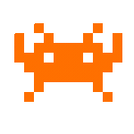
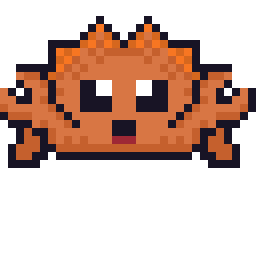
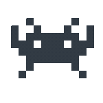
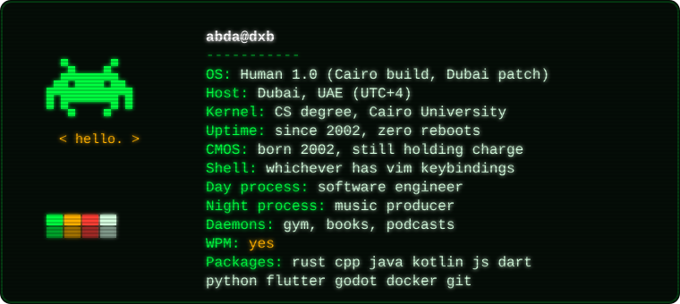
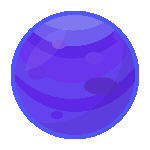

<div align="center">




    

</div>

```diff
  Last login: today, from a mechanical keyboard that woke up the neighbors

+  █████╗  ██████╗  ██████╗   █████╗
+ ██╔══██╗ ██╔══██╗ ██╔══██╗ ██╔══██╗
+ ███████║ ██████╔╝ ██║  ██║ ███████║
+ ██╔══██║ ██╔══██╗ ██║  ██║ ██╔══██║
+ ██║  ██║ ██████╔╝ ██████╔╝ ██║  ██║
+ ╚═╝  ╚═╝ ╚═════╝  ╚═════╝  ╚═╝  ╚═╝

@@ MOTD @@
  this machine hosts fun projects only.
- serious code lives elsewhere and signed an NDA.
```


> [!TIP]
> `man abda | head -3` for the humans in a hurry: I'm Abdallah El Belkasy, AbdA for short. Software engineer in Dubai, CS grad from Cairo University, music producer after dark. Everything below is the long version, in the only format this machine respects.

## `abda@dxb:~$ whoami`

```properties
abda = present
uid = 2002 (abda)
gid = 1337 (fun-projects)
groups = engineers, producers, lifters, fast-typists
```

## `abda@dxb:~$ neofetch`



<div align="center">


</div>

```diff
-      _~^~^~_
-  \) /  o o  \ (/     the crab stays.
-    '_   -   _'       the crab has seniority.
-    | '-----' |
```

## `abda@dxb:~$ ls ~/fun-projects`

```diff
- ls: output does not fit on one screen
@@ hint @@
  the shelves are right below this readme. compilers, bots, trains,
+ a very proud B-Tree. take whatever you like, star what you love
```

## `abda@dxb:~/fun-projects$ cat .secrets`

```diff
- cat: .secrets: permission denied
```

```diff
  abda@dxb:~/fun-projects$ sudo cat .secrets
  [sudo] password for abda:

+ 1. the gym playlist is 40% tracks I produced myself. nobody can stop me
+ 2. speed typing is not a skill, it is a coping mechanism for slow compilers
+ 3. there is a whole game in a private repo. the aliens are beta testing it
- 4. bench press: [REDACTED UNDER PROTOCOL 7: HE ASKED US NICELY]
- 5. known weakness: ████████ (nice try)
```

<details>
<summary>📁 <code>cat /honeypot/passwords.txt</code> (DO NOT OPEN)</summary>
<br>

```diff
  you opened it. bold.
  the incident response team is one guy and he is at the gym.
  password list, as promised:

+ 1. hunter2

+    ▀▄ ▄▀
+   ▄█▀█▀█▄     you win one (1) alien.
+   █ ▀▀▀ █     spend it wisely.
+    ▀▀ ▀▀
```

</details>

## `abda@dxb:~$ crontab -l`

```bash
# m   h    dom mon dow   command
  0   6    *   *   1-6   gym --split=push-pull-legs --no-skip-leg-day
  30  8    *   *   1-5   code --mode=engineer --coffee=required
  0   19   *   *   *     GYM.EXE --evening-slot
  0   19   *   *   *     STUDIO.EXE --evening-slot   # CONFLICT: both claim 19:00, loser gets 21:00
  0   21   *   *   *     daw --open --promise="just one loop" --actual=3h
  0   23   *   *   *     book --pages=20 || book --pages=5 --honest
  59  23   *   *   *     git push origin life --force-with-lease
  *   *    *   *   *     typing-test --silent --flex-only-if-above-120
```

## `abda@dxb:~$ journalctl -u abda --since 2002`

```diff
  [2002.██.██]  subject deployed to Cairo. loud from day one
  [20██.██.██]  first computer. the power button click was addictive
  [201█.██.██]  learns what a pointer is. subject is never the same
  [2019.12.21]  joins github. first commit is a bot, obviously
  [202█.██.██]  graduates Cairo University, computer science
  [202█.██.██]  discovers the gym. variables get heavier
  [2026.██.██]  relocated to Dubai node. sand patch applied successfully
+ [NOW]         writing this readme instead of finishing a side project
```

## `abda@dxb:~$ man abda`

<details>
<summary><b>ABDA(1) &nbsp;&nbsp; Fun Projects Manual &nbsp;&nbsp; click to read the manual page</b></summary>
<br>

```text
ABDA(1)                     Fun Projects Manual                     ABDA(1)

NAME
       abda - software engineer, music producer, progressive overloader

SYNOPSIS
       abda [--code LANG] [--lift PLATES] [--produce BPM] [--read PAGES]

DESCRIPTION
       Abdallah El Belkasy. Known in the wild as AbdA. Computer science
       graduate from Cairo University. Compiled in Cairo, currently
       deployed in Dubai on UTC+4. Ships software by day and drum
       patterns by night. This GitHub instance is his arcade cabinet,
       stocked with compilers, bots, trains and one very proud B-Tree.

OPTIONS
       --code LANG
              accepts rust, c++, java, kotlin, javascript, dart, python.
              rust invocations may include unsolicited crab facts.

       --lift PLATES
              increments monotonically. never returns early.

       --produce BPM
              opens the DAW. the "one loop" promise is decorative.

       --type
              no arguments. it is simply fast.

EXIT STATUS
       does not exit. see crontab(1), the 23:59 entry.

BUGS
       cannot pass an unfinished side project without starting a new one.
       marked WONTFIX by the maintainer.

SEE ALSO
       linkedin(1), twitter(1), discord(1), gym(8)
```

</details>

## `abda@dxb:~$ ps aux | grep stats`

<div align="center">


 


<sub>productive-time runs on UTC+4. the late spikes are the DAW's fault. subject knows. subject commits anyway.</sub>

</div>

## `abda@dxb:~$ top -p $(pgrep snake)`

```diff
  PID    USER   COMMAND         STATUS
+ 1337   abda   snake.service   eating my contributions. do not disturb.
```

<div align="center">

<picture>
  <source media="(prefers-color-scheme: dark)" srcset="https://raw.githubusercontent.com/Abdaishere/Abdaishere/output/github-snake-dark.svg">
  <source media="(prefers-color-scheme: light)" srcset="https://raw.githubusercontent.com/Abdaishere/Abdaishere/output/github-snake.svg">
  
</picture>

</div>

## `abda@dxb:~$ sudo apt install free-time`

```diff
+ Reading package lists... done
- E: Unable to locate package free-time
- E: closest match is 'gym' which is already the newest version

  abda@dxb:~$ sudo make me a sandwich
  [sudo] password for abda:
+ fine. one sandwich. it is chicken and rice. it is always chicken and rice.

  abda@dxb:~$ touch grass
+ touch: 'grass' created successfully (Dubai edition: touch sand)

  abda@dxb:~$ work-life-balance
- bash: work-life-balance: command not found
@@ did you mean @@
+ gym && code && music && repeat
```

## `abda@dxb:~$ history | tail`

```bash
  501  git commit -m "fix"
  502  git commit -m "actually fix"
  503  git commit -m "ok NOW it works. final. v2. REAL"
  504  vim track_final_master_bounce_3.md
  505  :q
  506  :q!
  507  ok that was the shell not vim
  508  cargo build --release && gym    # the build finishes when I do
  509  rm -rf node_modules             # a small funeral, as a treat
  510  history | tail                  # observing myself. it never ends well
```

<details>
<summary>⚠️ <b>DO NOT PRESS</b></summary>
<br>

```diff
- *** FATAL EXCEPTION 0E : LEG_DAY_HAS_OCCURRED ***
- stop code: 0xDEADL1F7

  A problem has been detected: quadriceps unresponsive
  stack trace: squat() -> squat() -> squat() -> regret()

  Press any key to reboot.
  Your monitor does not have keys.
+ Exactly.
```

</details>

## `abda@dxb:~$ ping abda --all-interfaces`

```diff
  dialing... ATDT 4217-4207-1523-7048-32
  (yes, that phone number is my actual Discord ID. the modem knows.)
+ 4 interfaces up, 0% packet loss, replies within one day usually
```

<div align="center">

<a href="https://linkedin.com/in/abdallahelbelkasy"></a>
<a href="https://twitter.com/abdaishere"></a>
<a href="https://discord.com/users/421742071523704832"></a>
<a href="mailto:abdallahemohmad2002@gmail.com"></a>

</div>

## `abda@dxb:~$ exit`

```diff
  logout
+ Saving session state... done
- Stopping music daemon... refused, one more loop
+ star something on your way out. the mainframe remembers who did.
- Connection to abda closed.
```

<div align="center">



<sub>screen burn-in courtesy of a CRT that never sleeps. thanks for stopping by, the aliens will see you out.</sub>

<br>

   


<sub>It is now safe to turn off your computer.</sub>

</div>
