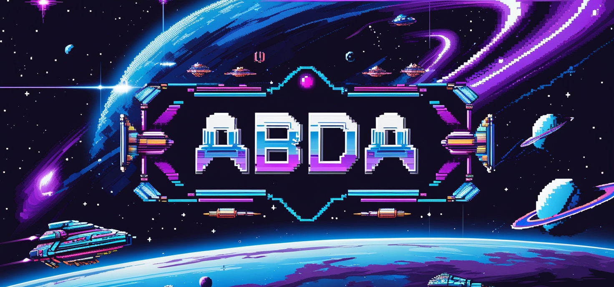

<div align="center">



    

# Hi there!  I'm Abdallah (AbdA) El Belkasy

<a href="https://github.com/Abdaishere">
  
</a>


</div>

> **This profile is my arcade.** Every repo here is a fun project — built to learn something, break something, or just because it sounded cool at 2 AM. Insert coin and look around. 🪙

<br>

## 🕹️ PLAYER 1 — SELECT

```yaml
name:        Abdallah El Belkasy (AbdA)
class:       Software Engineer
origin:      Cairo, Egypt 🇪🇬
education:   Computer Science, Cairo University 🎓
alignment:   Chaotic Curious
quests:      [distributed systems, game dev, web, compilers, anything shiny]
motto:       "Lives to learn, build, and dream big"
status:      ready to collaborate ✅
```


**Side quests unlocked:**
- 🎵 Music producer — beats between builds
- 💪 Bodybuilding — compiling muscle, zero warnings
- ⌨️ Speed typing — WPM go brrr
- 📚 Books & podcasts on infinite loop

<br>

## ⚔️ INVENTORY (Tech Stack)

<div align="center">

<a href="#"></a>

</div>

<br>

## 🗺️ LEVEL SELECT (Featured Fun Projects)

<div align="center">

| | |
|---|---|
| [](https://github.com/Abdaishere/E-Jam) | [](https://github.com/Abdaishere/KinectDepthImage) |
| [](https://github.com/Abdaishere/Tiny-C-Compiler) | [](https://github.com/Abdaishere/Fuzzy-Logic-Toolbox) |
| [](https://github.com/Abdaishere/Traino) | [](https://github.com/Abdaishere/mp3-and-png-to-pptx) |

<sub>🧪 network testing • 👾 Kinect vision • ⚙️ a compiler from scratch • 🧠 fuzzy logic • 🚂 train booking • 🎤 the cursed mp3→pptx converter</sub>

</div>

<br>

## 📊 HIGH SCORES

<div align="center">


</div>

<br>

## 🤝 CO-OP MODE (Let's Connect!)

<div align="center">

[](https://linkedin.com/in/abdallahelbelkasy)
[](https://twitter.com/abdaishere)
[](https://discord.com/users/421742071523704832)
[](mailto:abdallahemohmad2002@gmail.com)

</div>

<br>

<div align="center">

### 🐍 The snake ate my contributions

<picture>
  <source media="(prefers-color-scheme: dark)" srcset="https://raw.githubusercontent.com/abdaishere/abdaishere/output/github-snake-dark.svg" />
  <source media="(prefers-color-scheme: light)" srcset="https://raw.githubusercontent.com/abdaishere/abdaishere/output/github-snake.svg" />
  
</picture>


<sub>⭐ Thanks for stopping by — GAME OVER... or is it? Press F5 to continue.</sub>

</div>
