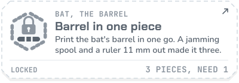
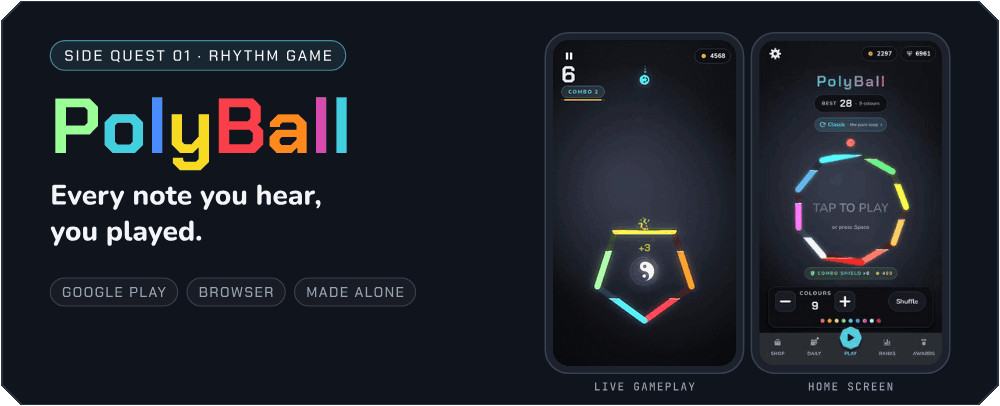

<a href="https://abdaishere.com"><picture><source media="(prefers-color-scheme: dark)" srcset="readme/header-dark.svg"></picture></a>

<p align="center">
<a href="https://abdaishere.com/polyball/play/"><picture><source media="(prefers-color-scheme: dark)" srcset="readme/btn-play-dark.svg"></picture></a>
<a href="https://github.com/Abdaishere/monitor-buddy/releases/tag/v1.0.0"><picture><source media="(prefers-color-scheme: dark)" srcset="readme/btn-buddy-v4e-dark.svg"></picture></a>
<a href="https://abdaishere.com"><picture><source media="(prefers-color-scheme: dark)" srcset="readme/btn-site-dark.svg"></picture></a>
</p>

<p align="center"><b>I'm Abdallah (AbdA), in Dubai. I make games, desk gadgets and 3D prints for fun.</b><br>Up there is a run of PolyBall, a rhythm game I made alone: free to play on Google Play and in your browser. Better with sound.</p>

## Trophies

<p align="center"><b>8 of 9 unlocked.</b> Six are here, three are in the scrap bin under them. Every card opens its proof.</p>

<p align="center">
<a href="https://abdaishere.com/polyball/#built"><picture><source media="(prefers-color-scheme: dark)" srcset="readme/ach-v5c-synth-dark.svg"></picture></a>
<a href="https://abdaishere.com/polyball/#built"><picture><source media="(prefers-color-scheme: dark)" srcset="readme/ach-v5c-silent-dark.svg"></picture></a>
<a href="https://github.com/Abdaishere/monitor-buddy/blob/66d4b00909da3dcdab9cfa5ebde7849aa952956f/tools/buddy_link.py#L133-L137"><picture><source media="(prefers-color-scheme: dark)" srcset="readme/ach-v5c-tests-dark.svg"></picture></a>
<a href="https://github.com/Abdaishere/E-Jam/commits/main/Admin%20Client/e_jam_backend"><picture><source media="(prefers-color-scheme: dark)" srcset="readme/ach-v5c-plane-dark.svg"></picture></a>
<a href="https://abdaishere.com/prints/bat/"><picture><source media="(prefers-color-scheme: dark)" srcset="readme/ach-v5c-bat-dark.svg"></picture></a>
<a href="https://abdaishere.com/prints/bat/#pieces"><picture><source media="(prefers-color-scheme: dark)" srcset="readme/ach-v5c-barrel-dark.svg"></picture></a>
</p>

<div align="center">
<details>
<summary><b>Scrap bin</b>: 3 more, all from the printer</summary>
<br>
<a href="https://abdaishere.com/prints/bat/#gap"><picture><source media="(prefers-color-scheme: dark)" srcset="readme/ach-v5c-p97-dark.svg"></picture></a>
<a href="https://abdaishere.com/prints/panamera-sculpture/#print"><picture><source media="(prefers-color-scheme: dark)" srcset="readme/ach-v5c-supports-dark.svg"></picture></a>
<a href="https://abdaishere.com/prints/blaster/#trigger"><picture><source media="(prefers-color-scheme: dark)" srcset="readme/ach-v5c-trigger-dark.svg"></picture></a>
</details>
</div>

<p align="center"><sub>GitHub gave me <a href="https://github.com/Abdaishere?tab=achievements">three of its own</a>: Pull Shark x2, Quickdraw and YOLO. YOLO took <a href="https://github.com/Abdaishere/E-Jam/pull/21">one typo fix in my own repo</a>, merged 3 seconds after I opened it, with zero reviews. That one was free. These were not.</sub></p>

## Patch notes

```diff
@@ polyball @@
+ On Google Play, 13 Nov.
+ 19 releases in.
+ Browser boot freeze:
+ 9.2 s down to 5.7 s.
+ Windows build: 32 MB lighter.
@@ monitor-buddy @@
+ v1.0.0 is out, 21 Nov.
- Dock v7 resets the board.
+ Dock v8 doesn't.
```

## Side quests

<a href="https://abdaishere.com/polyball/play/"></a>

I designed, built and released it alone. Closed source, free to play: on Google Play since 13 November 2026, and in the browser with nothing to install.

- **The band joins as your streak grows.** Bass at 2, arpeggio at 5, lead at 8. Hit Fever and the whole screen turns gold. One miss and it all stops.
- **Bots test it.** CI on GitHub Actions across six build targets, and bots play 24 runs per pass, missing on purpose.
- **15 languages**, with the Arabic right-to-left layout covered by tests.
- **Leaderboard** on Supabase (PostgreSQL), with a monthly cup and anti-cheat on the server.

**PolyBall, any%: 19 releases in 55 days.** Splits from the [public releases page](https://github.com/Abdaishere/abdaishere.github.io/releases):

| Split | Release | Time |
|:-:|:-|:-|
| 1 | v0.9.2, the first one there | day&nbsp;0<br><sub>19&nbsp;Sep&nbsp;2026</sub> |
| 6 to 8 | v0.9.8, v0.9.9 and v0.9.10: three in one day | day&nbsp;12<br><sub>1&nbsp;Oct&nbsp;2026</sub> |
| 9 | v0.10.0 | day&nbsp;13<br><sub>2&nbsp;Oct&nbsp;2026</sub> |
| 19 | v0.10.11, on Google Play | day&nbsp;55<br><sub>13&nbsp;Nov&nbsp;2026</sub> |

**[Play it in your browser](https://abdaishere.com/polyball/play/)** · [Google Play](https://play.google.com/store/apps/details?id=com.polyball.game) · [How it's built](https://abdaishere.com/polyball/#built)

<br>

<a href="https://github.com/Abdaishere/monitor-buddy"></a>

A tiny ESP32 desk screen with a face. It's my fork of [IdefixRC's Monitor-Buddy](https://github.com/IdefixRC/Monitor-Buddy): the base firmware, the web flasher and the printed holder are theirs. What the fork adds:

- **Desk features.** It chews at lunch, goes red when CI fails and says ON AIR while the mic is on.
- **A Linux helper app**, packaged as a .deb.
- **Signed updates over Wi-Fi**, and Wi-Fi credentials sealed with `AES-256-GCM`.
- **A simulator:** the real firmware running on a PC, where a whole day at the desk passes in seconds.
- **A keyboard dock**, built on their holder and printed on my printer. Version 8 was the first that stopped resetting the board.

[Release v1.0.0](https://github.com/Abdaishere/monitor-buddy/releases/tag/v1.0.0) · [Repository](https://github.com/Abdaishere/monitor-buddy) (MIT) · [The write-up](https://abdaishere.com/prints/monitor-buddy/)

<br>

<a href="https://github.com/Abdaishere/E-Jam"></a>

It runs RFC 2544 and RFC 2889 benchmarks on network switches. It was my graduation project at Cairo University: five of us built it, with engineers from Siemens EDA as our mentors.

I wrote Center Point, the control plane, in Rust on Actix Web: a REST API that moves every stream, device and process through explicit state machines and reads the test statistics from Apache Kafka. The strip on the card is one stream's trip. I also built the Flutter admin app, the dashboard in the picture.

[Repository](https://github.com/Abdaishere/E-Jam) (MIT) · [Contributors](https://github.com/Abdaishere/E-Jam/graphs/contributors) · [Project page](https://abdaishere.com/e-jam/)

<br>

<a href="https://abdaishere.com/prints/"></a>

I design the parts in code with CadQuery and print them on a Creality K1 Max, a box 30 cm on every side. So far: [an 84 cm baseball bat](https://abdaishere.com/prints/bat/), [a Panamera in 44 slices](https://abdaishere.com/prints/panamera-sculpture/) with two colours from one nozzle, [three gel blaster parts measured from phone photos](https://abdaishere.com/prints/blaster/) (the first trigger fit nowhere) and Monitor Buddy's dock. The tally on [the prints page](https://abdaishere.com/prints/): 4 projects, 37 h of plastic, 983 g, failed tries included.

They live on [abdaishere.com](https://abdaishere.com), my site, my own design and build in HTML, CSS and JavaScript, no framework.

## Inventory

| Item | Stat |
|:-|:-|
| <code>Creality&nbsp;K1&nbsp;Max</code> | A box 30 cm on every side. The bat is 84 cm. |
| <code>M8&nbsp;steel&nbsp;rod</code> | 13 dirhams at a hardware shop. The bat's pieces sit on it. |
| <code>ESP32-C6</code> | A 1.47-inch touchscreen, 320 by 172 pixels. It has a face. |
| <code>Godot&nbsp;4</code> | The engine under PolyBall. |
| <code>CadQuery</code> | Printed parts are designed in code. |
| <code>A&nbsp;ruler</code> | 11 mm out. See the locked trophy. |

<details>
<summary><b>Secret level</b></summary>
<br>

```gcode
; abdallah.gcode, a profile, sliced
; save file created: Dec 2019
M190 S60         ; wait for the bed
M109 S215        ; wait for the nozzle
G28              ; home: Dubai
G29              ; level the bed. Then level the idea.
G1 Z0.2 F600     ; first layer: a sketch on paper
G1 X120 E6       ; then a prototype, ugly on purpose
M0               ; pause to admire it
M300 S523 P150   ; C
M300 S659 P150   ; E
M300 S784 P300   ; G. Every note you hear, you played.
; ICPC 2021: contestant
M117 Done: 84 cm bat, 30 cm printer
M84              ; motors off
```


</details>

<br>

<p align="center"><picture><source media="(prefers-color-scheme: dark)" srcset="readme/continue-dark.svg"></picture></p>

<p align="center"><a href="https://abdaishere.com">abdaishere.com</a> · <a href="https://abdaishere.com/polyball/play/">Play PolyBall</a> · <a href="https://github.com/Abdaishere/monitor-buddy">Monitor Buddy</a> · <a href="https://www.linkedin.com/in/abdallahelbelkasy">LinkedIn</a></p>
