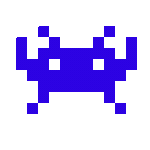
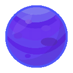

<h1 align="center">
      <div>   </div>
      <div>     </div>
      Hi there! 
      <br>  I'm Abdallah (AbdA) El Belkasy
</h1>
<h3 align="center">Software engineer who lives to learn, build, and dream big 🚀</h3>

### About Me 🎮

- 🎓 Computer Science graduate from Cairo University
- 🎯 Currently exploring full-stack development
- 🌟 Passionate about distributed systems, game development, and building things that matter

### Tech Stack 💻

```yaml
Languages: Rust, C++, Java, JavaScript, Dart, Python
Tools: Linux, Docker, Vim
```

### Fun Facts 

- 🎵 Music producer in my free time
- 💪 Bodybuilding enthusiast 
- ⌨️ Speed typing
- 📚 Avid reader and podcast listener

### Let's Connect! 🤝

[](https://linkedin.com/in/abdallahelbelkasy)
[](https://twitter.com/abdaishere)
[](https://discord.com/users/421742071523704832)

<picture>
  <source media="(prefers-color-scheme: dark)" srcset="https://raw.githubusercontent.com/abdaishere/abdaishere/output/github-snake-dark.svg" />
  <source media="(prefers-color-scheme: light)" srcset="https://raw.githubusercontent.com/abdaishere/abdaishere/output/github-snake.svg" />
  
</picture>
